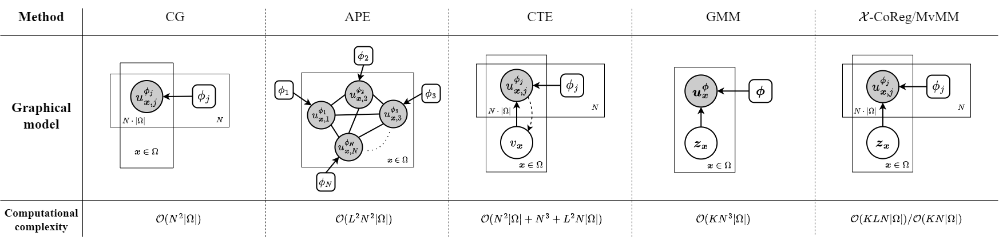

# $\mathcal{X}$-Metric
Welcome! This library provides the official implementation of our  paper: $\mathcal{X}$-Metric: An N-Dimensional Information-Theoretic Framework for Groupwise Registration and Deep Combined Computing [[TPAMI](https://ieeexplore.ieee.org/document/9965747)] [[arXiv](https://arxiv.org/abs/2211.01631)]. We also benchmarked several (multimodal) intensity-based groupwise registration [algorithms](https://github.com/xzluo97/X-metric/tree/main/core/models/algorithms) represented as the following graphical models.



## Usage

For multimodal groupwise registration, taking the BrainWeb data (`./core/data/BrainWeb/test.zip`) as an example, you could run `./core/trainers/Brainweb/BrainWebGroupRegTrainer.py` by the following code:

```shell
python -W ignore BrainWebGroupRegTrainer.py \
       -g #SET GPU DEVICE ID# \
       -tedsp #SET YOUR OWN TEST DATA PATH# \
       -ifl #SET INITIAL FFD LEVEL# \
       -mt #SET MODEL TYPE# \
       -nc #SET NUMBER OF CLASSES# \
       -tt FFD \
       -ffds #SET FFD SPACINGS# \
       -ffdi \
       --alpha #SET REGULARIZATION COEFFICIENT#\
       -lr #SET STEP SIZE# \
       -steps #SET NUMBER OF STEPS#
```

For deep combined computing on the MSCMR dataset, you could run `./core/trainers/MSCMR/MSCMRDCCTrainer.py` by the following code:

```shell
python -W ignore MSCMRDCCTrainer.py \
       -g #SET GPU DEVICE ID# \
       -trdsp #SET YOUR OWN TRAINING DATA PATH# \
       -vdsp #SET YOUR OWN VALIDATION DATA PATH# \
       -tedsp #SET YOUR OWN TEST DATA PATH# \
       -cp # clamp probability \
       -sup_mods #SET MODALITIES WITH LABELS# \
       -up # use probaility maps \
       -tt DDF \
       -epochs #SET TRAINING EPOCHS# \
       -isp #SET NUMBER OF INTERLEAVING STEPS# \
       -bs #SET TRAINING BATCH SIZE#
```

## Bonus

Lecture notes on introducing mutual information based image registration can be found [here](https://github.com/xzluo97/mutual-information-registration).

## Citation

If you find the code useful, please cite our paper as follows:

```bibtex
@article{luo2022xmetric,
  title={X-Metric: An N-Dimensional Information-Theoretic Framework for Groupwise Registration and Deep Combined Computing},
  author={Luo, Xinzhe and Zhuang, Xiahai},
  journal={IEEE Transactions on Pattern Analysis and Machine Intelligence},
  year={2022},
  publisher={IEEE},
  doi={10.1109/TPAMI.2022.3225418}
}
```
